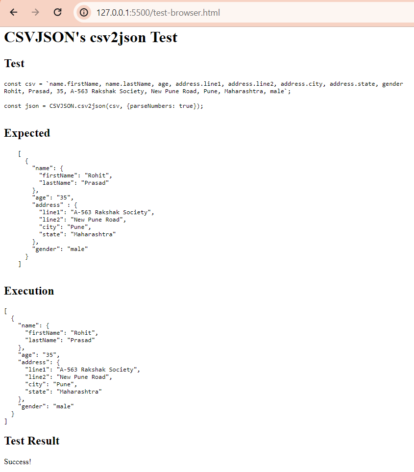
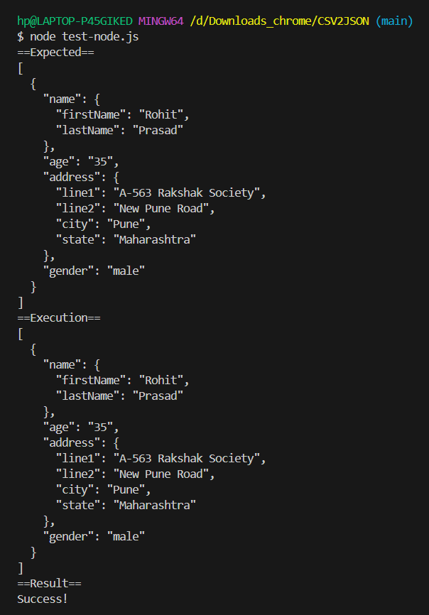

# **Project Title**: csv2json

Single function `csv2json` to reliably convert CSV to JSON. Self contained without dependencies.

## Usage

Simply call `csv2json` passing a string to obtain JSON. The string may be CSV (comma separated values), TSV (tab separated values) or semi-colon separated values (typically used in French Excel). It will auto-detect the separator although you may override or force it via the `separator` option.

### Node example

```js
const csv2json = require('./csv2json.js');

const csv = `name.firstName, name.lastName, age, address.line1, address.line2, address.city, address.state, gender 
Rohit, Prasad, 35, A-563 Rakshak Society, New Pune Road, Pune, Maharashtra, male`;

const json = csv2json(csv, {parseNumbers: true});
console.log(json);
```

### Browser example

Note: In the browser, global namespace `CSVJSON` is created. It contains the `csv2json` function.

```html
<script type="text/javascript" src="csv2json.js"></script>
<script>
    const csv = `name.firstName, name.lastName, age, address.line1, address.line2, address.city, address.state, gender 
	Rohit, Prasad, 35, A-563 Rakshak Society, New Pune Road, Pune, Maharashtra, male`;

    const json = CSVJSON.csv2json(csv, {parseNumbers: true});
    console.log(json);
</script>
```

In both cases, you would get this in the console:

```json
[
  {
    "name": {
      "firstName": "Rohit",
      "lastName": "Prasad"
    },
    "age": "35",
    "address": {
      "line1": "A-563 Rakshak Society",
      "line2": "New Pune Road",
      "city": "Pune",
      "state": "Maharashtra"
    },
    "gender": "male"
  }
]
```

## Documentation

`csv2json` supports a number of options passed as an optional hash:

- `separator`: Character which acts as separator. If omitted, will attempt to detect comma `,`, semi-colon `;` or tab `\t`.
- `parseNumbers`: If set to `true` will attempt to convert a value to a number, if possible.
- `parseJSON`: If set to `true` will attempt to convert a value to a valid JSON value if possible. Detects numbers, `null`, `false`, `true`, `[]` and `{}`.
- `transpose`: If set to `true` will pivot the table. The first column becomes the header.
- `hash`: If set to `true` will use the first column as a key and return a hash instead of an array of objects.

## Tests

Run the tests in your browser by opening `test-browser.html`.

Run the tests through node:

```sh
node test-node.js
```

## **Options**:

- `parseNumbers`: Set to `true` to parse numeric values from the CSV data.

## **Contributing:**

Contributions to this project are welcome. Fork the repository, make your changes, and submit a pull request.

## **License**:

This project is licensed under the ISC License.

## **Author:**

Aditya Narayan Jaiswal
Email: nlaxmi886@gmail.com

## Some Screenshots:




